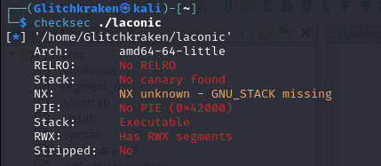
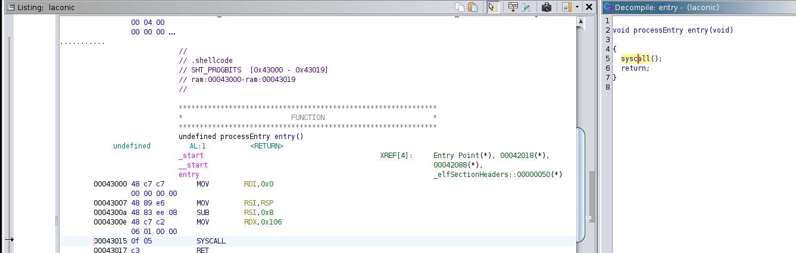
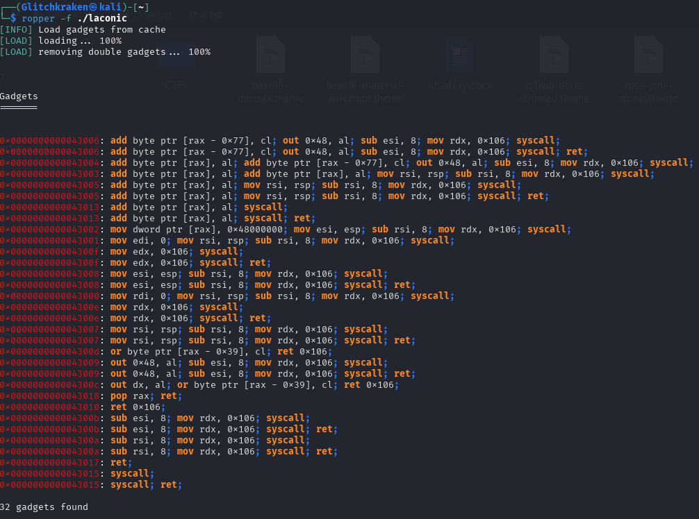
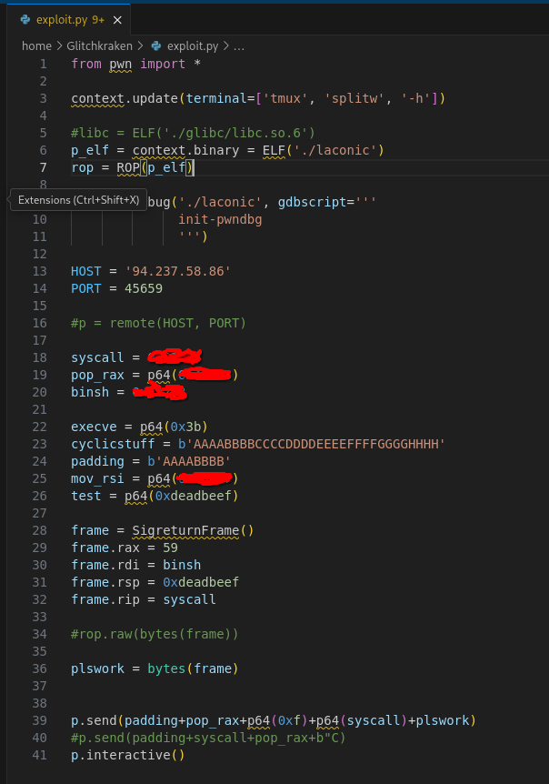
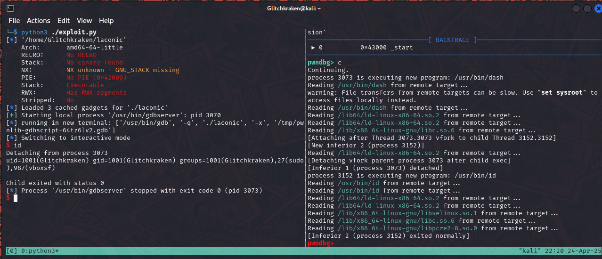

# Hack The Box Cyber Apocalypse 2025 -- Pwn: Laconic 

Writeup by Glitchkraken / SpiffyLich

## Tools Used: 
- [Pwndbg](https://github.com/pwndbg/pwndbg)
- [Pwntools](https://docs.pwntools.com/en/stable/)
- [Ghidra](https://ghidra-sre.org/)
- [Ropper](https://github.com/sashs/Ropper)
- [Syscall Table](https://blog.rchapman.org/posts/Linux_System_Call_Table_for_x86_64/)

## Description

Before we delve too deep into analysis, I always like to run checksec, as it
allows us to get an overview of a binary and its potential security setup...

or, in this case, its complete lack thereof. 

Alright, so this at least tells us that whatever we want to try will probably work- but what do we actually have to work with, as far as the binary goes? Lets check the main function in Ghidra.

Oh. so literally just an empty syscall() ? well, that should be syscall read, technically. 
This is a good start, but maybe there's pieces of code laying around that will let us construct a useful rop chain? 

Normally, here is where we would look for gadgets- that is, small sections of assembly that end in 'ret'- that would allow us to setup the registers to do... anything. a specific syscall, with arguments of our choosing, a pre-existing function with custom arguments, you name it! 

The problem here is, we really dont have many 'pop' gadgets- specifically, we lack the pop rdi radget, which would at least let us setup the first argument. 

We DO, however, have a pop rax gadget, which means we can still call **any** system-call we want. 

So, the big question is: 'is there a system-call which allows us control over registers?' and technically, the answer is: yes. Sigreturn. 

An amazing overview of what sigreturn is can be found 
[here](https://docs.pwntools.com/en/stable/rop/srop.html), by pwntools... and a great writeup by sharkmoos that helped me understand [here](https://sharkmoos.medium.com/a-quick-demonstration-of-sigreturn-oriented-programming-d9ae98c3ab0e). 

The gist of it is we lie to the computer, and tell it we're returning from an interrupt, and then craft a fake context for the computer to return to- a context with all the registers set exactly how we want- perhaps, set to open /bin/sh?

Above is the final, working implementation -- addresses omitted, but desperation not. 
The result? We get our shell!: 

